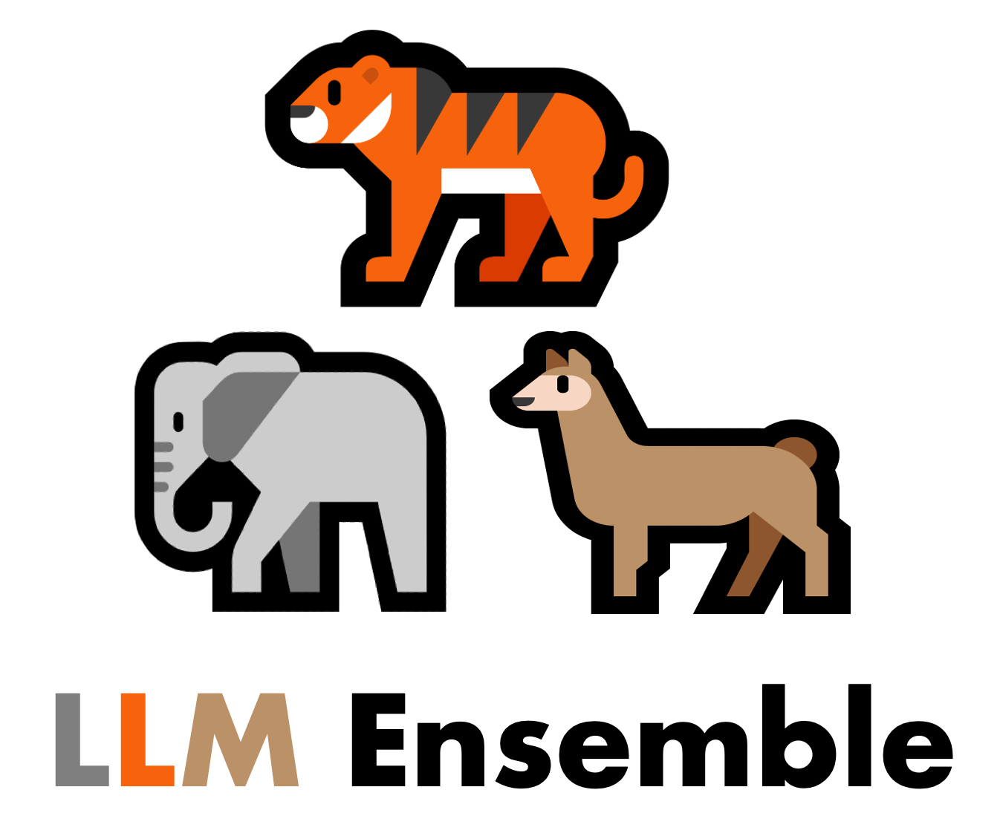
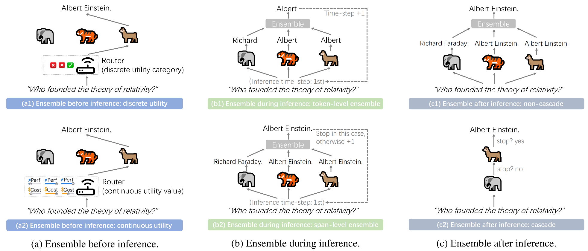
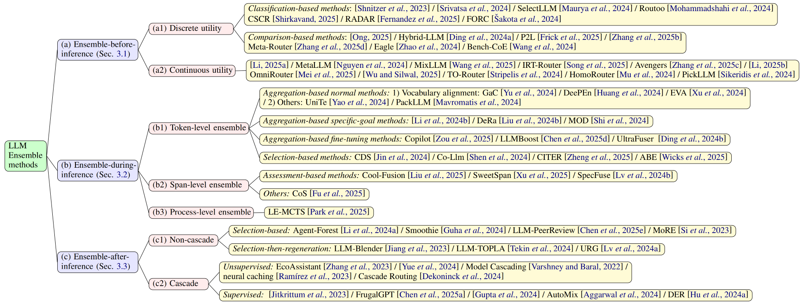
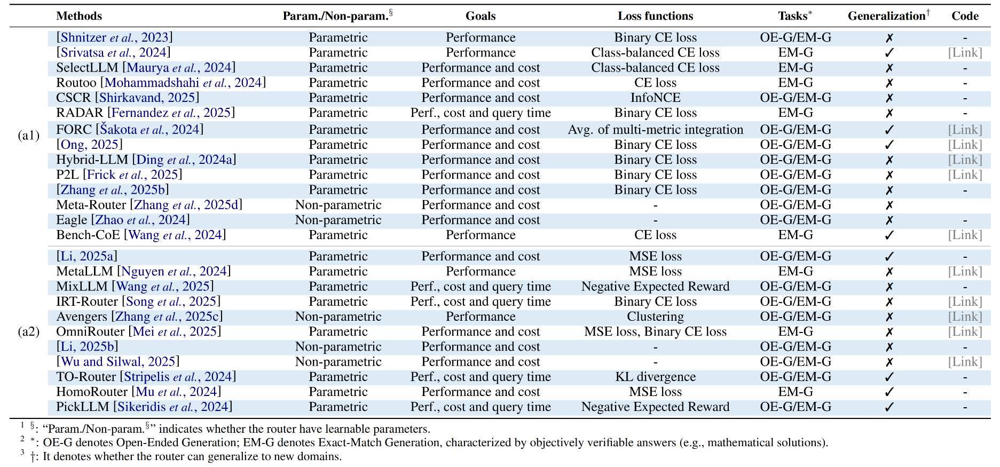
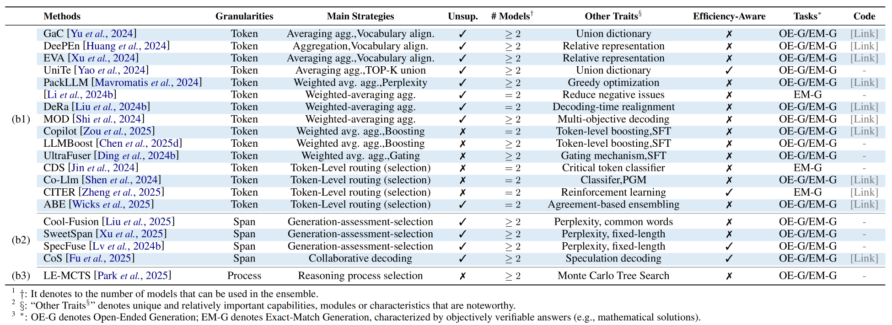
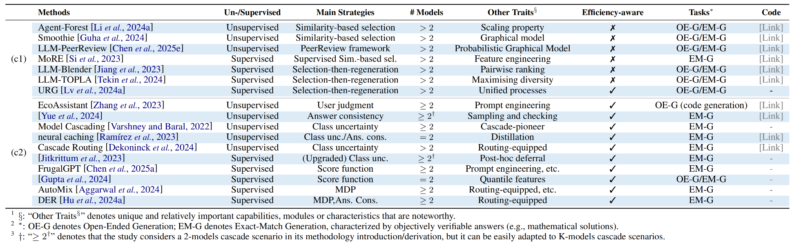
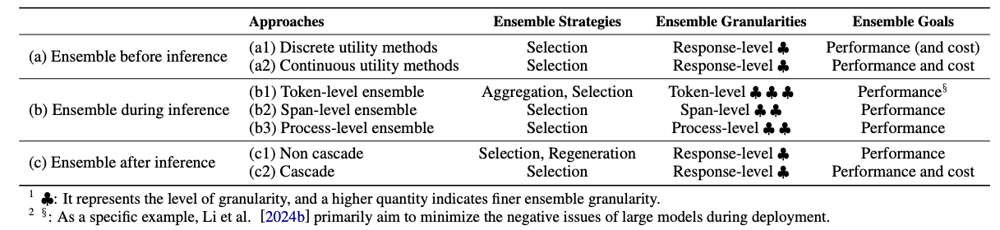

<h1 align="center">🔥🔥🔥 Awesome-LLM-Ensemble

"Harnessing Multiple Large Language Models: A Survey on LLM Ensemble"  (ArXiv 2025) </h2>

<p align="center">
    <a href="https://zhijunchen-ai.github.io/">Zhijun Chen</a>,
   <a href="https://scholar.google.com/citations?user=JEdD0o8AAAAJ&hl">Xiaodong Lu</a>,
    <a href="https://scholar.google.com/citations?user=6v6JfdsAAAAJ&hl=zh-en">Jingzheng Li</a>,
    <a href="https://scholar.google.com/citations?user=mzXg1s8AAAAJ&hl=zh-en">Pengpeng Chen</a>,
    <a href="https://lizhuoran-nlp.github.io/">Zhuoran Li</a>,
    <a href="https://scholar.google.com/citations?user=buUlnJUAAAAJ&hl=zh-en">Kai Sun</a>,
    <a href="https://luoyk1999.github.io/">Yuankai Luo</a>,
    <a href="https://scholar.google.com/citations?hl=zh-CN&user=PnDqlPkAAAAJ&view_op=list_works&sortby=pubdate">Qianren Mao</a>,
    <a href="https://scholar.google.com/citations?user=H3pKglUAAAAJ&hl=zh-en">Ming Li</a>,    
    <a href="https://www.researchgate.net/scientific-contributions/Likang-Xiao-2257895822">Likang Xiao</a>,
    <a href="https://scholar.google.co.uk/citations?user=fnfg9S0AAAAJ&hl=en">Dingqi Yang</a>,
    <a href="https://scholar.google.com/citations?user=Be21PkYAAAAJ">Xiao Huang</a>,
    <a href="https://www.banyikun.com/">Yikun Ban</a>,
    <a href="https://scholar.google.com/citations?user=HWOWCdcAAAAJ&hl=zh-CN">Hailong Sun</a>,
    <a href="https://scholar.google.com/citations?user=D0lL1r0AAAAJ&hl=zh-CN/">Philip S. Yu</a>
</p>
<p align="center">
    
</p>


<p align="center">
  <a href='https://arxiv.org/abs/2502.18036'></a>
  <a href="https://junchenzhi.github.io/LLM-Ensemble/">
    
  </a>
  <a href="https://mp.weixin.qq.com/s/yVWzHQmr_KyyOfY5k3ivOw">
    
  </a>
</p>


<p align="center">
      <a href="https://github.com/junchenzhi/Awesome-LLM-Ensemble/commits/main">
        
      </a>
      <a href="https://github.com/junchenzhi/Awesome-LLM-Ensemble/blob/main/LICENSE">
        
      </a>
      <a href="https://awesome.re">
        
      </a>
  <a href="https://img.shields.io/badge/PRs-Welcome-red">
    
  </a>
  <a href=""></a>
</p>


<p align="center">
      <a href="https://github.com/junchenzhi/Awesome-LLM-Ensemble/stargazers">
        
      </a>
      <a href="https://github.com/junchenzhi/Awesome-LLM-Ensemble/network">
        
      </a>
</p>


<h5 align="center">If you like our project, please give it a star ⭐ to show your support！Thank you:)

</h5>


# 📣 Notices
> 🔥🔥🔥 This is a collection of papers on  ***LLM Ensemble***.  
> <a href='https://arxiv.org/abs/2502.18036'>
>   
> </a>
> <a href="https://junchenzhi.github.io/LLM-Ensemble/">
>   
> </a>
> <a href="https://mp.weixin.qq.com/s/yVWzHQmr_KyyOfY5k3ivOw">
>   
> </a>


> 🔥🔥🔥 **[Stay tuned for our journal-style  paper,  incorporating the latest papers proposed in recent months.]**    
>


> **[Always] [Add your papers in this repo]** ***Thank you to all the papers that have cited our survey! 
We will add all related citing papers to this GitHub repo, in a timely manner, to help increase the visibility of your contributions.***     
>


> **[Always] [Maintain]** ***We will make this list updated frequently!***     
> If you found any error or any missed/new paper, please don't hesitate to contact [us](zhijunchen@buaa.edu.cn) or Pull requests. 

---


&nbsp; 
&nbsp;  
&nbsp; 


- [Contents](#Awesome-LLM-Ensemble)
  - [1. LLM Ensemble and Taxonomy](#1-llm-ensemble-and-taxonomy)
    - [1.1 LLM Ensemble](#11-llm-ensemble)
    - [1.2 Taxonomy](#12-taxonomy)
  - [2. Papers](#2-papers)
    - [2.1 Ensemble Before Inference](#21-ensemble-before-inference)
      - [2.1.1 (a,1) Pre-Trained Router](#211-a1-pre-trained-router)
      - [2.1.2 (a,2) Non pre-trained router](#212-a2-non-pre-trained-router)
    - [2.2 Ensemble During Inference](#22-ensemble-during-inference)
      - [2.2.1 (b,1) Token-Level Ensemble](#221-b1-token-level-ensemble)
      - [2.2.2 (b,2) Span-Level Ensemble](#222-b2-span-level-ensemble)
      - [2.2.3 (b,3) Process-Level Ensemble](#223-b3-process-level-ensemble)
    - [2.3 Ensemble After Inference](#23-ensemble-after-inference)
      - [2.3.1 (c,1) Non Cascade](#231-c1-non-cascade)
      - [2.3.2 (c,2) Cascade](#232-c2-cascade)
    - [2.4 Others: Benchmarks, Applications, Systems and Related Surveys](#24-others-benchmarks-applications-systems-and-related-surveys)
      - [2.4.1 Benchmarks](#241-benchmarks)
      - [2.4.2 Applications](#242-applications)
      - [2.4.3 Systems](#243-systems)
      - [2.4.4 Related Surveys](#244-related-surveys)
  - [3 Others: Some public implementations of the LLM Ensemble methods](#3-others-some-public-implementations-of-the-llm-ensemble-methods)
  - [4 Others: Some other related interesting papers](#4-others-some-other-related-interesting-papers)
      - [4.1 Test-Time Scaling](#41-test-time-scaling)
      - [4.2 LLM Collaboration and Others](#42-llm-collaboration-and-others)
  - [5 Summarization](#5-summarization)
  - [6 Citing This Paper](#6-citing-this-paper)


# 1. LLM Ensemble and Taxonomy

## 1.1 LLM Ensemble
**Paper Abstract**:

LLM Ensemble---which involves the comprehensive use of multiple large language models (LLMs), each aimed at handling user queries during the downstream inference, to benefit from their individual strengths---has gained substantial attention recently. 
The widespread availability of LLMs, coupled with their varying strengths and out-of-the-box usability, has profoundly advanced the field of LLM Ensemble. 
This paper presents the first systematic review of recent developments in LLM Ensemble. 
First, we introduce our taxonomy of LLM Ensemble and discuss several related research problems. 
Then, we provide a more in-depth classification of methods under the broad categories of ``ensemble-before-inference, ensemble-during-inference, ensemble-after-inference'', and review all relevant methods. Finally, we introduce related benchmarks and applications, summarize existing studies, and suggest several future research directions. 
A curated list of papers  on LLM Ensemble is available at https://github.com/junchenzhi/Awesome-LLM-Ensemble.

## 1.2 Taxonomy

<div align=center>


**Figure 1:  Illustration of LLM Ensemble Taxonomy.** (Note that for *(b) ensemble-during-inference* paradigm, there is also a *process-level ensemble* approach that we have not represented in the figure, mainly because that this approach is instantiated by a single method.)
</div>


<div align=center>


**Figure 2: Taxonomy of All LLM Ensemble Methods. (Please note that this figure may not be fully updated to include all the papers listed below.)**
</div>


- ***(a) Ensemble before inference.***  
Since the ensemble-before-inference methods require routing a query to the most suitable LLM before LLM inference, the core of such methods lies in predicting the utility of candidate models for a given query under certain preferences (e.g., performance or cost). Based on how they formulate the utility of candidate LLMs, we divide existing methods into two categories:
  - ***(a1) Discrete utility*** methods, discretize the model utility into categorical labels;
  - ***(a2) Continuous utility*** methods model LLM utility as real-valued variables, such as response length or performance scores. This formulation enables a fine-grained characterization of model behavior, capturing subtle performance differences obscured by categorical definitions.


- ***(b) Ensemble during inference.***  
As the most granular form of ensemble among the three broad categories, this type of approach encompasses: 
  - ***(b1) Token-level ensemble*** methods, which integrate the token-level outputs of multiple models at the finest granularity of decoding;
  - ***(b2) Span-level ensemble*** methods, which conduct ensemble at the level of a sequence fragment (e.g., a span of four words); 
  - ***(b3) Process-level ensemble*** methods, which select the optimal reasoning process step-by-step within the reasoning chain for a given complex reasoning task. 
Note that for these ensemble-during-inference methods, the aggregated text segments will be concatenated with the previous text and fed again to models.


- ***(c) Ensemble after inference.***  
These methods can be classified into two categories:
  - ***(c1) Non cascade*** methods, which perform ensemble using multiple complete responses contributed from all LLM candidates;
  - ***(c2) Cascade*** methods, which consider both performance and inference costs, progressively reasoning through a chain of LLM candidates largely sorted by model size to find the most suitable inference response.


---


&nbsp; 
&nbsp;  
&nbsp; 


# 2. Papers

## 2.1 Ensemble Before Inference


<div align=center>


Figure 3:  Summary analysis of the key attributes of ensemble-before-inference methods.  (Please note that this table may not be fully updated to include all the papers listed below.)
</div>


### 2.1.1 (a,1) Discrete utility methods


| Date | Name | Title | Paper/Github |
|:---:|:---:|:---|:---:|
| 2025-10 | <code>DiSRouter</code> | DISROUTER: Distributed Self-Routing for LLM Selections | <a href="https://arxiv.org/abs/2510.19208"></a><br>- |
| 2025-06 | <code>TagRouter</code> | TAGROUTER: Learning Route to LLMs through Tags for Open-Domain Text Generation Tasks | <a href="https://arxiv.org/abs/2506.12473"></a><br>- |
| 2025-06 | <code>Router-R1</code> | Router-R1: Teaching LLMs Multi-Round Routing and Aggregation via Reinforcement Learning | <a href="https://arxiv.org/abs/2506.09033"></a><br><a href="https://github.com/ulab-uiuc/Router-R1"></a> |
| 2025-06 | <code>RadialRouter</code> | RadialRouter: Structured Representation for Efficient and Robust Large Language Models Routing | <a href="https://www.arxiv.org/abs/2506.03880"></a><br>- |
| 2025-05 | <code>RTR</code> | Route to Reason: Adaptive Routing for LLM and Reasoning Strategy Selection | <a href="https://arxiv.org/abs/2505.19435"></a><br><a href="https://github.com/goodmanpzh/Route-To-Reason"></a> |
| 2024-12 | <code>Bench-CoE</code> | Bench-CoE: a Framework for Collaboration of Experts from Benchmark | <a href="https://arxiv.org/abs/2412.04167"></a><br><a href="https://github.com/ZhangXJ199/Bench-CoE"></a> |
| 2024-10 | <code>GraphRouter</code> | GraphRouter: A Graph-based Router for LLM Selections | <a href="https://arxiv.org/abs/2410.03834"></a><br><a href="https://github.com/ulab-uiuc/GraphRouter"></a> |
| 2024-09 | <code>Eagle</code> | Eagle: Efficient Training-Free Router for Multi-LLM Inference | <a href="https://arxiv.org/abs/2409.15518"></a><br>- |
| 2024-08 | <code>SelectLLM</code> | SelectLLM: Query-Aware Efficient Selection Algorithm for Large Language Models | <a href="https://arxiv.org/abs/2408.08545"></a><br>- |
| 2024-06 | <code>RouteLLM</code> | RouteLLM: Learning to Route LLMs with Preference Data | <a href="https://arxiv.org/abs/2406.18665"></a><br><a href="https://github.com/lm-sys/RouteLLM"></a> |
| 2024-05 | <code>LLM Routing Lessons</code> | Harnessing the Power of Multiple Minds: Lessons Learned from LLM Routing | <a href="https://arxiv.org/abs/2405.00467"></a><br><a href="https://github.com/kvadityasrivatsa/llm-routing"></a> |
| 2024-04 | <code>Hybrid-LLM</code> | Hybrid LLM: Cost-Efficient and Quality-Aware Query Routing | <a href="https://arxiv.org/abs/2404.14618"></a><br><a href="https://github.com/m365-core/hybrid_llm_routing"></a> |
| 2024-03 | <code>ETR</code> | An Expert is Worth One Token: Synergizing Multiple Expert LLMs as Generalist via Expert Token Routing | <a href="https://arxiv.org/abs/2403.16854"></a><br><a href="https://github.com/zjunet/ETR"></a> |
| 2024-01 | <code>Routoo</code> | Routoo: Learning to Route to Large Language Models Effectively | <a href="https://arxiv.org/abs/2401.13979"></a><br>- |
| 2024 | <code>RouterDC</code> | RouterDC: Query-Based Router by Dual Contrastive Learning for Assembling Large Language Models | <a href="https://proceedings.neurips.cc/paper_files/paper/2024/hash/7a641b8ec86162fc875fb9f6456a542f-Abstract-Conference.html"></a><br><a href="https://github.com/shuhao02/RouterDC"></a> |
| 2023-11 | <code>ZOOTER</code> | Routing to the Expert: Efficient Reward-guided Ensemble of Large Language Models | <a href="https://arxiv.org/abs/2311.08692"></a><br>- |
| 2023-08 | <code>FORC</code> | Fly-Swat or Cannon? Cost-Effective Language Model Choice via Meta-Modeling | <a href="https://arxiv.org/abs/2308.06077"></a><br><a href="https://github.com/epfl-dlab/forc"></a> |
| 2023 | <code>Benchmark Routing</code> | LLM Routing with Benchmark Datasets | <a href="https://openreview.net/forum?id=k9EfAJhFZc"></a><br>- |

### 2.1.2 (a,2) Continuous utility methods


| Date | Name | Title | Paper/Github |
|:---:|:---:|:---|:---:|
| 2025-10 | <code>WebRouter</code> | WebRouter: Query-specific Router via Variational Information Bottleneck for Cost-sensitive Web Agent | <a href="https://arxiv.org/abs/2510.11221"></a><br>- |
| 2025-10 | <code>LLMRank</code> | LLMRank: Understanding LLM Strengths for Model Routing | <a href="https://arxiv.org/abs/2510.01234"></a><br>- |
| 2025-05 | <code>Avengers</code> | The Avengers: A Simple Recipe for Uniting Smaller Language Models to Challenge Proprietary Giants | <a href="https://arxiv.org/abs/2505.19797"></a><br><a href="https://github.com/ZhangYiqun018/Avengers"></a> |
| 2025-05 | <code>InferenceDynamics</code> | InferenceDynamics: Efficient Routing Across LLMs through Structured Capability and Knowledge Profiling | <a href="https://arxiv.org/abs/2505.16303"></a><br>- |
| 2025-05 | <code>kNN Router</code> | Rethinking Predictive Modeling for LLM Routing: When Simple kNN Beats Complex Learned Routers | <a href="https://arxiv.org/abs/2505.12601"></a><br>- |
| 2025 | <code>RELM</code> | Co-optimizing Recommendation and Evaluation for LLM Selection | <a href="https://openreview.net/pdf?id=gWi4ZcPQRl"></a><br>- |
| 2025-02 | <code>LLM Bandit</code> | LLM Bandit: Cost-Efficient LLM Generation via Preference-Conditioned Dynamic Routing | <a href="https://arxiv.org/abs/2502.02743"></a><br>- |
| 2024-12 | <code>PickLLM</code> | PickLLM: Context-Aware RL-Assisted Large Language Model Routing | <a href="https://arxiv.org/abs/2412.12170"></a><br>- |
| 2024-08 | <code>TO-Router</code> | TensorOpera Router: A Multi-Model Router for Efficient LLM Inference | <a href="https://arxiv.org/abs/2408.12320"></a><br>- |
| 2024-07 | <code>MetaLLM</code> | MetaLLM: A High-performant and Cost-efficient Dynamic Framework for Wrapping LLMs | <a href="https://arxiv.org/abs/2407.10834"></a><br><a href="https://github.com/mail-research/MetaLLM-wrapper/"></a> |
| 2024-06 | <code>HomoRouter</code> | Query Routing for Homogeneous Tools: An Instantiation in the RAG Scenario | <a href="https://arxiv.org/abs/2406.12429"></a><br>- |
| 2024-01 | <code>Blending</code> | Blending Is All You Need: Cheaper, Better Alternative to Trillion-Parameters LLM | <a href="https://arxiv.org/abs/2401.02994"></a><br>- |
## 2.2 Ensemble During Inference

<div align=center>


Figure 4:  Summary analysis of the key attributes of ensemble-during-inference methods.  (Please note that this table may not be fully updated to include all the papers listed below.)
</div>


### 2.2.1 (b,1) Token-Level Ensemble


| Date | Name | Title | Paper/Github |
|:---:|:---:|---|:---:|
| 2025-10 | `SAFE` | When to Ensemble: Identifying Token-Level Points for Stable and Fast LLM Ensembling | <a href="https://arxiv.org/pdf/2510.15346"></a><br>- |
| 2025-10 | `CoRe` | Harnessing Consistency for Robust Test-Time LLM Ensemble | <a href="https://www.arxiv.org/abs/2510.13855"></a><br>- |
| 2025-05 | `Transformer Copilot` | Transformer Copilot: Learning from The Mistake Log in LLM Fine-tuning | <a href="https://arxiv.org/abs/2505.16270"></a><br><a href="https://github.com/jiaruzouu/TransformerCopilot"></a> |
| 2025-02 | `ABE` | Token-level Ensembling of Models with Different Vocabularies | <a href="https://arxiv.org/abs/2502.21265"></a><br><a href="https://github.com/mjpost/abe"></a> |
| 2025-02 | `CITER` | CITER: Collaborative Inference for Efficient Large Language Model Decoding with Token-Level Routing | <a href="https://arxiv.org/abs/2502.01976"></a><br><a href="https://github.com/aiming-lab/CITER"></a> |
| 2025-02 | `Speculative Ensemble` | Speculative Ensemble: Fast Large Language Model Ensemble via Speculation | <a href="https://arxiv.org/abs/2502.01662"></a><br><a href="https://github.com/Kamichanw/Speculative-Ensemble/"></a> |
| 2024-10 | `UniTe` | Determine-Then-Ensemble: Necessity of Top-k Union for Large Language Model Ensembling | <a href="https://arxiv.org/abs/2410.03777"></a><br>- |
| 2024-06 | `GaC` | Breaking the Ceiling of the LLM Community by Treating Token Generation as a Classification for Ensembling | <a href="https://arxiv.org/abs/2406.12585"></a><br><a href="https://github.com/yaoching0/GaC"></a> |
| 2024-04 | `DeePEn` | Ensemble Learning for Heterogeneous Large Language Models with Deep Parallel Collaboration | <a href="https://arxiv.org/abs/2404.12715"></a><br><a href="https://github.com/OrangeInSouth/DeePEn"></a> |
| 2024-04 | `PackLLM` | Pack of LLMs: Model Fusion at Test-Time via Perplexity Optimization | <a href="https://arxiv.org/abs/2404.11531"></a><br><a href="https://github.com/cmavro/PackLLM"></a> |
| 2024-04 | `EVA` | Bridging the Gap between Different Vocabularies for LLM Ensemble | <a href="https://arxiv.org/abs/2404.09492"></a><br><a href="https://github.com/xydaytoy/EVA"></a> |
| 2024-02 | `-` | Purifying large language models by ensembling a small language model | <a href="https://arxiv.org/abs/2402.14845"></a><br>- |

### 2.2.2 (b,2) Span-Level Ensemble


| Date | Name | Title | Paper/Github |
|:---:|:---:|---|:---:|
| 2025-06 | `RLAE` | RLAE: Reinforcement Learning-Assisted Ensemble for LLMs | <a href="https://arxiv.org/abs/2506.00439"></a><br>- |
| 2024-12 | `SpecFuse` | SpecFuse: Ensembling Large Language Models via Next-Segment Prediction | <a href="https://arxiv.org/abs/2412.07380"></a><br>- |
| 2024-09 | `SweetSpan` | Hit the Sweet Spot! Span-Level Ensemble for Large Language Models | <a href="https://arxiv.org/abs/2409.18583"></a><br>- |
| 2024-07 | `Cool-Fusion` | Cool-Fusion: Fuse Large Language Models without Training | <a href="https://arxiv.org/abs/2407.19807"></a><br>- |


### 2.2.3 (b,3) Process-Level Ensemble


| Date | Name | Title | Paper/Github |
|:---:|:---:|---|:---:|
| 2025-11 | `CBS` | Collaborative Beam Search: Enhancing LLM Reasoning via Collective Consensus | <a href="https://aclanthology.org/2025.emnlp-main.574/"></a><br>- |
| 2024-12 | `LE-MCTS` | Ensembling Large Language Models with Process Reward-Guided Tree Search for Better Complex Reasoning | <a href="https://arxiv.org/abs/2412.15797"></a><br>- |

&nbsp; 


## 2.3 Ensemble After Inference


<div align=center>


Figure 5:  Summary analysis of the key attributes of ensemble-after-inference methods.  (Please note that this table may not be fully updated to include all the papers listed below.)
</div>


### 2.3.1 (c,1) Non Cascade

| Date | Name | Title | Paper/Github |
|:---:|:---:|---|:---:|
| 2025-12 | `LLM-PeerReview` | Scoring, Reasoning, and Selecting the Best! Ensembling Large Language Models via a Peer-Review Process | <a href="https://arxiv.org/abs/2512.23213"></a><br><a href="https://github.com/zeyuji/LLM-PeerReview"></a> |
| 2025-10 | `LLMartini` | LLMartini: Seamless and Interactive Leveraging of Multiple LLMs through Comparison and Composition | <a href="https://arxiv.org/abs/2510.19252"></a><br>- |
| 2025-10 | `-` | Beyond Consensus: Mitigating the Agreeableness Bias in LLM Judge Evaluations | <a href="https://arxiv.org/abs/2510.11822"></a><br><a href="https://github.com/ai-cet/paper-arxiv-llm-judge-calibration"></a> |
| 2025-10 | `OW/ISP` | Beyond Majority Voting: LLM Aggregation by Leveraging Higher-Order Information | <a href="https://www.arxiv.org/abs/2510.01499"></a><br>- |
| 2025-09 | `FLAME` | Explainable Fault Localization for Programming Assignments via LLM-Guided Annotation | <a href="https://arxiv.org/pdf/2509.25676v1"></a><br><a href="https://github.com/FLAME-FL/FLAME"></a> |
| 2025-09 | `CARGO` | CARGO: A Framework for Confidence-Aware Routing of Large Language Models | <a href="https://arxiv.org/abs/2509.14899"></a><br>- |
| 2025-07 | `LENS` | LENS: Learning Ensemble Confidence from Neural States for Multi-LLM Answer Integration | <a href="https://arxiv.org/abs/2507.23167"></a><br>- |
| 2025-05 | `EL4NER` | EL4NER: Ensemble Learning for Named Entity Recognition via Multiple Small-Parameter Large Language Models | <a href="https://arxiv.org/abs/2505.23038"></a><br>- |
| 2025-03 | `Symbolic-MoE` | Symbolic Mixture-of-Experts: Adaptive Skill-based Routing for Heterogeneous Reasoning | <a href="https://arxiv.org/abs/2503.05641"></a><br><a href="https://github.com/dinobby/Symbolic-MoE/"></a> |
| 2025-01 | `DFPE` | DFPE: A Diverse Fingerprint Ensemble for Enhancing LLM Performance | <a href="https://arxiv.org/abs/2501.17479"></a><br><a href="https://github.com/nivgold/DFPE"></a> |
| 2025-01 | `DMoA` | Balancing Act: Diversity and Consistency in Large Language Model Ensembles | <a href="https://openreview.net/pdf?id=Dl6nkKKvlX"></a><br>- |
| 2024-12 | `Smoothie` | Smoothie: Label Free Language Model Routing | <a href="https://arxiv.org/abs/2412.04692"></a><br><a href="https://github.com/HazyResearch/smoothie"></a> |
| 2024-10 | `LLM-Forest` | LLM-Forest: Ensemble Learning of LLMs with Graph-Augmented Prompts for Data Imputation | <a href="https://arxiv.org/abs/2410.21520"></a><br><a href="https://github.com/Xinrui17/LLM-Forest"></a> |
| 2024-10 | `LLM-TOPLA` | LLM-TOPLA: Efficient LLM Ensemble by Maximising Diversity | <a href="https://arxiv.org/abs/2410.03953"></a><br><a href="https://github.com/git-disl/llm-topla"></a> |
| 2024-10 | `MLKF` | Two Heads are Better than One: Zero-shot Cognitive Reasoning via Multi-LLM Knowledge Fusion | <a href="https://dl.acm.org/doi/abs/10.1145/3627673.3679744"></a><br><a href="https://github.com/trueBatty/MLKF"></a> |
| 2024-08 | `URG` | URG: A Unified Ranking and Generation Method for Ensembling Language Models | <a href="https://aclanthology.org/2024.findings-acl.261/"></a><br>- |
| 2024-02 | `Agent-Forest` | More Agents Is All You Need | <a href="https://arxiv.org/abs/2402.05120"></a><br><a href="https://github.com/MoreAgentsIsAllYouNeed/AgentForest"></a> |
| 2023-06 | `LLM-Blender` | LLM-Blender: Ensembling Large Language Models with Pairwise Ranking and Generative Fusion | <a href="https://arxiv.org/abs/2306.02561"></a><br><a href="https://github.com/yuchenlin/LLM-Blender"></a> |
| 2023-05 | `MoRE` | Getting MoRE out of Mixture of Language Model Reasoning Experts | <a href="https://arxiv.org/abs/2305.14628"></a><br><a href="https://github.com/NoviScl/MoRE"></a> |


### 2.3.2 (c,2) Cascade


| Date | Name | Title | Paper/Github |
|:---:|:---:|---|:---:|
| 2025-12 | `RoBoN` | RoBoN: Routed Online Best-of-n for Test-Time Scaling with Multiple LLMs | <a href="https://www.arxiv.org/abs/2512.05542"></a><br><a href="https://github.com/j-geuter/RoBoN"></a> |
| 2025-09 | `-` | Semantic Agreement Enables Efficient Open-Ended LLM Cascades | <a href="https://www.arxiv.org/abs/2509.21837"></a><br>- |
| 2025-04 | `EMAFusionTM` | EMAFusionTM: A Self-Optimizing System for Seamless LLM Selection and Integration | <a href="https://arxiv.org/abs/2504.10681"></a><br>- |
| 2025-04 | `ModelSwitch` | Do We Truly Need So Many Samples? Multi-LLM Repeated Sampling Efficiently Scales Test-Time Compute | <a href="https://arxiv.org/abs/2504.00762"></a><br><a href="https://github.com/JianhaoChen-nju/ModelSwitch"></a> |
| 2024-12 | `DER` | Dynamic Ensemble Reasoning for LLM Experts | <a href="https://arxiv.org/abs/2412.07448"></a><br>- |
| 2024-10 | `Cascade Routing` | A Unified Approach to Routing and Cascading for LLMs | <a href="https://arxiv.org/abs/2410.10347"></a><br><a href="https://github.com/eth-sri/cascade-routing"></a> |
| 2024-04 | `-` | Language Model Cascades: Token-level uncertainty and beyond | <a href="https://arxiv.org/abs/2404.10136"></a><br>- |
| 2023-10 | `AutoMix` | AutoMix: Automatically Mixing Language Models | <a href="https://arxiv.org/abs/2310.12963"></a><br><a href="https://github.com/automix-llm/automix"></a> |
| 2023-10 | `neural caching` | Cache & Distil: Optimising API Calls to Large Language Models | <a href="https://arxiv.org/abs/2310.13561"></a><br><a href="https://github.com/guillemram97/neural-caching"></a> |
| 2023-10 | `-` | Large Language Model Cascades with Mixture of Thoughts Representations for Cost-efficient Reasoning | <a href="https://arxiv.org/abs/2310.03094"></a><br><a href="https://github.com/MurongYue/LLM_MoT_cascade"></a> |
| 2023-10 | `EcoAssistant` | EcoAssistant: Using LLM Assistant More Affordably and Accurately | <a href="https://arxiv.org/abs/2310.03046"></a><br><a href="https://github.com/JieyuZ2/EcoAssistant"></a> |
| 2023-05 | `FrugalGPT` | FrugalGPT: How to Use Large Language Models While Reducing Cost and Improving Performance | <a href="https://arxiv.org/abs/2305.05176"></a><br>- |
| 2023-01 | `-` | When Does Confidence-Based Cascade Deferral Suffice? | <a href="https://proceedings.neurips.cc/paper_files/paper/2023/hash/1f09e1ee5035a4c3fe38a5681cae5815-Abstract-Conference.html"></a><br>- |
| 2022-10 | `Model Cascading` | Model Cascading: Towards Jointly Improving Efficiency and Accuracy of NLP Systems | <a href="https://arxiv.org/abs/2210.05528"></a><br>- |


&nbsp; 

## 2.4 Others: Benchmarks, Applications, Systems and Related Surveys

### 2.4.1 Benchmarks


| Date | Name | Title | Paper/Github |
|:---:|:---:|---|:---:|
| 2025-12 | `-` | Scoring, Reasoning, and Selecting the Best! Ensembling Large Language Models via a Peer-Review Process | <a href="https://arxiv.org/abs/2512.23213"></a><br>[](https://github.com/zeyuji/LLM-PeerReview) |
| 2023 | `MixInstruct` | LLM-BLENDER: Ensembling Large Language Models with Pairwise Ranking and Generative Fusion | <a href="https://arxiv.org/abs/2306.02561"></a><br>[](https://github.com/yuchenlin/LLM-Blender) |
| 2024 | `RouterBench` | RouterBench: A Benchmark for Multi-LLM Routing System | <a href="https://arxiv.org/abs/2411.04424"></a><br>[](https://github.com/withmartian/routerbench) |
| 2025-04 | `Speculative Ensemble` | RouterEval: A Comprehensive Benchmark for Routing LLMs to Explore Model-level Scaling Up in LLMs | <a href="https://arxiv.org/abs/2503.10657"></a><br>[](https://github.com/MilkThink-Lab/RouterEval) |
| 2026 | `-` | LLMRouterBench: A Massive Benchmark and Unified Framework for LLM Routing | <a href="https://arxiv.org/abs/2601.07206"></a><br>[](https://github.com/ynulihao/LLMRouterBench) |
| 2026 | `-` | RouterArena: An Open Platform for Comprehensive Comparison of LLM Routers | <a href="https://arxiv.org/abs/2510.00202"></a><br>[](https://github.com/RouteWorks/RouterArena) |
| 2026 | `-` | FusionFactory: Fusing LLM Capabilities with Multi-LLM Log Data | <a href="https://arxiv.org/abs/2507.10540"></a><br>[](https://github.com/ulab-uiuc/FusionFactory) |


### 2.4.2 Applications


Beyond the methods presented before, the concept of LLM Ensemble has found applications in a variety of more specialized tasks and domains.
Here we give some examples:


| Date | Name | Title | Paper/Github |
|:---:|:---:|---|:---:|
| 2023 | `Ensemble-Instruct` | Ensemble-Instruct: Generating Instruction-Tuning Data with a Heterogeneous Mixture of LMs | [](https://arxiv.org/abs/2310.13961)<br>[](https://github.com/IBM/ensemble-instruct) |
| 2024 | `BWRS` | Bayesian Calibration of Win Rate Estimation with LLM Evaluators | [](https://arxiv.org/abs/2411.04424)<br>[](https://github.com/yale-nlp/bay-calibration-llm-evaluators) |
| 2024 | `-` | PromptMind Team at MEDIQA-CORR 2024: Improving Clinical Text Correction with Error Categorization and LLM Ensembles | [](https://arxiv.org/abs/2405.08373)<br>- |
| 2024 | `-` | LLM-Ensemble: Optimal Large Language Model Ensemble Method for E-commerce Product Attribute Value Extraction | [](https://arxiv.org/abs/2403.00863)<br>- |
| 2024 | `FuseGen` | FuseGen: PLM Fusion for Data-generation based Zero-shot Learning | [](https://arxiv.org/abs/2406.12527)<br>[](https://github.com/LindaLydia/FuseGen) |
| 2023 | `-` | On Preserving the Knowledge of Long Clinical Texts | [](https://arxiv.org/abs/2311.01571)<br>- |
| 2025 | `Consensus Entropy` | Consensus Entropy: Harnessing Multi-VLM Agreement for Self-Verifying and Self-Improving OCR | [](https://arxiv.org/abs/2504.11101)<br>- |
| 2025 | `Expert Orchestration` | Beyond Monoliths: Expert Orchestration for More Capable, Democratic, and Safe Large Language Models | [](https://arxiv.org/abs/2506.00051)<br>- |
| 2025 | `FLAME` | Explainable Fault Localization for Programming Assignments via LLM-Guided Annotation | [](https://arxiv.org/pdf/2509.25676v1)<br>[](https://github.com/FLAME-FL/FLAME) |


### 2.4.3 Systems


| Date | Name | Title | Paper/Github |
|:---:|:---:|---|:---:|
| 2025-10 | `LLMartini` | LLMartini: Seamless and Interactive Leveraging of Multiple LLMs through Comparison and Composition | [](https://www.arxiv.org/abs/2510.01499)<br>- |

### 2.4.4 Related Surveys


| Date | Name | Title | Paper/Github |
|:---:|:---:|---|:---:|
| 2024 | `Model Merging` | Model Merging in LLMs, MLLMs, and Beyond: Methods, Theories, Applications and Opportunities | <a href="https://arxiv.org/abs/2408.07666"></a><br><a href="https://github.com/EnnengYang/Awesome-Model-Merging-Methods-Theories-Applications"></a> |
| 2024 | `-` | Merge, Ensemble, and Cooperate! A Survey on Collaborative Strategies in the Era of Large Language Models | <a href="https://arxiv.org/abs/2407.06089"></a><br>- |
| 2025 | `-` | A Survey on Collaborative Mechanisms Between Large and Small Language Models | <a href="https://arxiv.org/abs/2505.07460"></a><br>- |
| 2023 | `-` | A comprehensive review on ensemble deep learning: Opportunities and challenges | <a href="https://www.sciencedirect.com/science/article/pii/S1319157823000228"></a><br>- |
| 2025 | `-` | Doing More with Less – Implementing Routing Strategies in Large Language Model-Based Systems: An Extended Survey | <a href="https://arxiv.org/abs/2502.00409"></a><br>- |
| 2024 | `MoErging` | A Survey on Model MoErging: Recycling and Routing Among Specialized Experts for Collaborative Learning | <a href="https://arxiv.org/abs/2408.07057"></a><br>- |
| 2023 | `Deep Model Fusion` | Deep Model Fusion: A Survey | <a href="https://arxiv.org/abs/2309.15698"></a><br>- |
| 2025 | `-` | Towards Efficient Multi-LLM Inference: Characterization and Analysis of LLM Routing and Hierarchical Techniques | <a href="https://www.arxiv.org/abs/2506.06579"></a><br>- |
| 2025 | `-` | Toward Edge General Intelligence with Multiple-Large Language Model (Multi-LLM): Architecture, Trust, and Orchestration | <a href="https://arxiv.org/abs/2507.00672"></a><br>- |
| 2025 | `Test-Time Scaling` | A Survey on Test-Time Scaling in Large Language Models: What, How, Where, and How Well | <a href="https://arxiv.org/abs/2503.24235"></a><br><a href="https://testtimescaling.github.io/"></a> |
| 2025 | `-` | Doing More with Less: A Survey on Routing Strategies for Resource Optimisation in Large Language Model-Based Systems | <a href="https://arxiv.org/abs/2502.00409"></a><br>- |
| 2025 | `-` | Dynamic Model Routing and Cascading for Efficient LLM Inference: A Survey | <a href="https://arxiv.org/abs/2603.04445"></a><br>- |


---

&nbsp; 
&nbsp;  
&nbsp; 

## 3 Others: Some public implementations of the LLM Ensemble methods 

| Date | Name | Title | Paper/Github |
|:---:|:---:|---|:---:|
| 2025-10 | `-` | Stable LLM Ensemble: Interaction between Example Representativeness and Diversity | [](https://arxiv.org/abs/2510.13143)<br>- |

---

&nbsp; 
&nbsp;  
&nbsp; 


## 4 Others: Some other related interesting papers 
Here we briefly list some related papers, which are either discovered by us or suggested by the authors to this repository. 
They mainly focus on **LLM Collaboration**.

### 4.1 Test-Time Scaling


| Date | Name | Title | Paper/Github |
|:---:|:---:|---|:---:|
| 2025-10 | `-` | Stable LLM Ensemble: Interaction between Example Representativeness and Diversity | [](https://arxiv.org/abs/2510.13143)<br>- |


### 4.2 LLM Collaboration and Others


| Date | Name | Title | Paper/Github |
|:---:|:---:|---|:---:|
| 2025-02 | `Heter-MAD` | If Multi-Agent Debate is the Answer, What is the Question? | [](https://arxiv.org/abs/2502.08788)<br>- |
| 2025-03 | `GENOME` | Nature-Inspired Population-Based Evolution of Large Language Models | [](https://arxiv.org/abs/2503.01155)<br>[](https://github.com/ZhangYiqun018/GENOME) |
| 2024-10 | `LLM-Forest` | LLM-Forest: Ensemble Learning of LLMs with Graph-Augmented Prompts for Data Imputation | [](https://arxiv.org/abs/2410.21520)<br>[](https://github.com/Xinrui17/LLM-Forest) |
| 2025-08 | `SLC` | Small-Large Collaboration: Training-efficient Concept Personalization for Large VLM | [](https://arxiv.org/abs/2508.07260)<br>[](https://github.com/Hhankyangg/SLC) |
| 2025-09 | `Best-of-∞` | Best-of-∞ -- Asymptotic Performance of Test-Time LLM Ensembling | [](https://arxiv.org/abs/2509.21091)<br>[](https://github.com/jkomiyama/BoInf-code-publish) |
| 2025-09 | `MoT` | Mixture of Thoughts: Learning to Aggregate What Experts Think, Not Just What They Say | [](https://arxiv.org/abs/2509.21164)<br>[](https://github.com/jacobfa/mot) |
| 2025-10 | `ColMAD` | Towards Scalable Oversight with Collaborative Multi-Agent Debate in Error Detection | [](https://arxiv.org/abs/2510.20963v1)<br>- |
| 2025-10 | `AdCo` | Adaptive Coopetition: Leveraging Coarse Verifier Signals for Resilient Multi-Agent LLM Reasoning | [](https://www.arxiv.org/abs/2510.18179)<br>[](https://github.com/AdCo-Research/adaptive-coopetition) |
| 2025-10 | `-` | Harmonizing Diverse Models: A Layer-wise Merging Strategy for Consistent Generation | [](https://www.arxiv.org/abs/2510.14915)<br>- |
| 2025-12 | `CogER` | Beyond Fast and Slow: Cognitive-Inspired Elastic Reasoning for Large Language Models | [](https://arxiv.org/abs/2512.15089)<br>- |

---

&nbsp; 
&nbsp;  
&nbsp; 

***************


## 5 Summarization 

<div align=center>

Figure 6:  Summary analysis of the key attributes of LLM Ensemble approaches.
</div> 

---

&nbsp; 
&nbsp;  
&nbsp; 

## 6 Citing This Paper


```
@article{chen2025harnessing,
  title={Harnessing Multiple Large Language Models: A Survey on LLM Ensemble},
  author={Chen, Zhijun and Lu, Xiaodong and Li, Jingzheng and Chen, Pengpeng and Li, Zhuoran and Sun, Kai and Luo, Yuankai and Mao, Qianren and Li, Ming and Xiao, Likang and Yang, Dingqi and Huang, Xiao and Ban, Yikun and Sun, Hailong and Yu, Philip S},
  journal={arXiv preprint arXiv:2502.18036},
  year={2025}
}
```

&nbsp; 
<div align=center>


</div> 

&nbsp; 