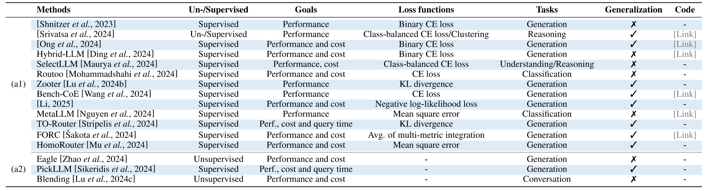
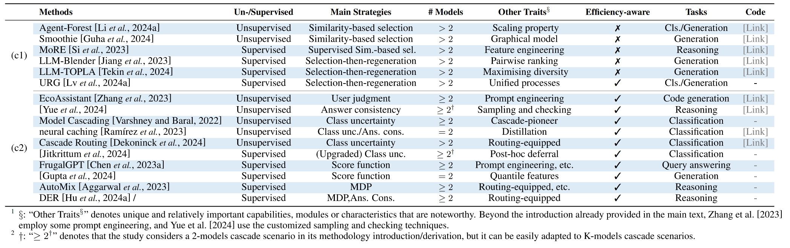

<h1 align="center">🔥🔥🔥 Awesome-LLM-Ensemble 

"Harnessing Multiple Large Language Models: A Survey on LLM Ensemble"</h2>
  <p align="center">
    <a href="https://scholar.google.com/citations?user=3slpkWAAAAAJ&hl=zh-CN">Zhijun Chen</a>,
    <a href="https://scholar.google.com/citations?user=6v6JfdsAAAAJ&hl=zh-CN">Jingzheng Li</a>,
    <a href="https://scholar.google.com/citations?user=mzXg1s8AAAAJ&hl=zh-CN">Pengpeng Chen</a>,
    <a href="https://scholar.google.com/citations?user=Hh-IHMoAAAAJ&hl=zh-CN">Zhuoran Li</a>,
    <a href="https://scholar.google.com/citations?user=buUlnJUAAAAJ&hl=zh-CN">Kai Sun</a>,
    <a href="https://luoyk1999.github.io/">Yuankai Luo</a>,
    <a href="https://scholar.google.com/citations?hl=zh-CN&user=PnDqlPkAAAAJ&view_op=list_works&sortby=pubdate">Qianren Mao</a>,
    <a href="https://scholar.google.co.uk/citations?user=fnfg9S0AAAAJ&hl=en">Dingqi Yang</a>,
    <a href="https://scholar.google.com/citations?user=HWOWCdcAAAAJ&hl=zh-CN">Hailong Sun</a>,
    <a href="https://scholar.google.com/citations?user=D0lL1r0AAAAJ&hl=zh-CN/">Philip S. Yu</a>
  </p>
  <p align="center">
    
  </p>
</p>


<p align="center">
  <a href='https://arxiv.org/abs/2502.18036'></a>
  <a href="https://junchenzhi.github.io/LLM-Ensemble/">
    
  </a>
</p>


<p align="center">
      <a href="https://github.com/junchenzhi/Awesome-LLM-Ensemble/commits/main">
        
      </a>
      <a href="https://github.com/junchenzhi/Awesome-LLM-Ensemble/blob/main/LICENSE">
        
      </a>
      <a href="https://awesome.re">
        
      </a>
  <a href="https://img.shields.io/badge/PRs-Welcome-red">
    
  </a>
  <a href=""></a>
</p>


<p align="center">
      <a href="https://github.com/junchenzhi/Awesome-LLM-Ensemble/stargazers">
        
      </a>
      <a href="https://github.com/junchenzhi/Awesome-LLM-Ensemble/network">
        
      </a>
</p>


<h5 align="center">If you like our project, please give it a star ⭐ to show your support！Thank you:)


For this emerging topic, we hope this project can provide some reference for researchers and look forward to more interesting studies!
</h5>


# 📣 Notices
> 🔥🔥🔥 This is a collection of papers on  ***LLM Ensemble***.   
It's based on our survey paper: Harnessing Multiple Large Language Models: A Survey on LLM Ensemble.   <a href='https://arxiv.org/abs/2502.18036'></a>    <a href="https://junchenzhi.github.io/LLM-Ensemble/">
    
  </a>


> **[Always] [Maintain]** ***Note that: We will make this list updated frequently (at least until 12/31/2025)!  
All newly discovered relevant papers will be updated in this repository within one week and in the arXiv paper within two months!***     
> If you found any error or any missed/new paper, please don't hesitate to contact [us](zhijunchen@buaa.edu.cn) or Pull requests. 

> **[Always] [Collaboration]** If you have any new and interesting ideas, feel free to discuss with us and explore potential collaborations.


# 📣 News

> **[4/17/2025]** We have added several new papers to this repository. Please search for the keyword "April 2025".  

> **[3/18/2025]** We would like to extend our gratitude to the authors of the following two papers for reaching out to us.  
> We have now added these papers to this repository: 1) "Purifying large language models by ensembling a small language model"; 2) "RouterDC: Query-Based Router by Dual Contrastive Learning for Assembling Large Language Models". 

---


&nbsp; 
&nbsp;  
&nbsp; 


- [Contents](#Awesome-LLM-Ensemble)
  - 1 [LLM Ensemble and Taxonomy](#1-llm-ensemble-and-taxonomy)
    - 1.1 [LLM Ensemble](#11-llm-ensemble)
    - 1.2 [Taxonomy](#12-taxonomy)
  - 2 [Papers](#2-papers)
    - 2.1 [Ensemble Before Inference](#21-ensemble-before-inference)
    - 2.2 [Ensemble During Inference](#22-ensemble-during-inference)
    - 2.3 [Ensemble After Inference](#23-ensemble-after-inference)
    - 2.4 [Others: Benchmarks and Applications](#24-others-benchmarks-and-applications)
  - 3 [Summarization](#3-summarization)
  -  [Citation](#citation)


# 1. LLM Ensemble and Taxonomy

## 1.1 LLM Ensemble
**Paper Abstract**:

LLM Ensemble---which involves the comprehensive use of multiple large language models (LLMs), each aimed at handling user queries during the downstream inference, to benefit from their individual strengths---has gained substantial attention recently. 
The widespread availability of LLMs, coupled with their varying strengths and out-of-the-box usability, has profoundly advanced the field of LLM Ensemble. 
This paper presents the first systematic review of recent developments in LLM Ensemble. 
First, we introduce our taxonomy of LLM Ensemble and discuss several related research problems. 
Then, we provide a more in-depth classification of methods under the broad categories of ``ensemble-before-inference, ensemble-during-inference, ensemble-after-inference'', and review all relevant methods. Finally, we introduce related benchmarks and applications, summarize existing studies, and suggest several future research directions. 
A curated list of papers  on LLM Ensemble is available at https://github.com/junchenzhi/Awesome-LLM-Ensemble.

## 1.2 Taxonomy

<div align=center>


**Figure 1:  Illustration of LLM Ensemble Taxonomy.** (Note that for *(b) ensemble-during-inference* paradigm, there is also a *process-level ensemble* approach that we have not represented in the figure, mainly because that this approach is instantiated by a single method.)
</div>


<div align=center>


**Figure 2: Taxonomy of All LLM Ensemble Methods. (Please note that this figure may not be fully updated to include all the papers listed below.)**
</div>


- ***(a) Ensemble before inference.***  
In essence, this approach employs a routing algorithm prior to LLM inference to allocate a specific query to the most suitable model, allowing the selected model that is specialized for the query and typically more cost-efficient inference to perform the task.
 Existing methods can be classified into two categories, depending on whether the router necessitates the use of pre-customized data for pre-training:   
  - ***(a1) Pre-training router;***
  - ***(a2) Non pre-training router.***


- ***(b) Ensemble during inference.***  
As the most granular form of ensemble among the three broad categories, this type of approach encompasses: 
  - ***(b1) Token-level ensemble*** methods, which integrate the token-level outputs of multiple models at the finest granularity of decoding;
  - ***(b2) Span-level ensemble*** methods, which conduct ensemble at the level of a sequence fragment (e.g., a span of four words); 
  - ***(b3) Process-level ensemble*** methods, which select the optimal reasoning process step-by-step within the reasoning chain for a given complex reasoning task. 
Note that for these ensemble-during-inference methods, the aggregated text segments will be concatenated with the previous text and fed again to models.


- ***(c) Ensemble after inference.***  
These methods can be classified into two categories:
  - ***(c1) Non cascade*** methods, which perform ensemble using multiple complete responses contributed from all LLM candidates;
  - ***(c2) Cascade*** methods, which consider both performance and inference costs, progressively reasoning through a chain of LLM candidates largely sorted by model size to find the most suitable inference response.


---


&nbsp; 
&nbsp;  
&nbsp; 


# 2. Papers

## 2.1 Ensemble Before Inference


<div align=center>


Figure 3:  Summary analysis of the key attributes of ensemble-before-inference methods.  (Please note that this table may not be fully updated to include all the papers listed below.)
</div>


- **Pack of LLMs: Model Fusion at Test-Time via Perplexity Optimization.** [Paper] (2024)  
  - Name: PackLLM, Code: [Official]  
- **Purifying large language models by ensembling a small language model.** [Paper] (2024)  
  - Name: -, Code: -


### 2.1.1 (a,1) Pre-Trained Router


- **LLM Routing with Benchmark Datasets.** [Paper] (2023)  
  <span style="color: gray;">Name: -, Code: -</span>

- **RouteLLM: Learning to Route LLMs with Preference Data.** [Paper] (2024)  
  <span style="color: gray;">Name: RouteLLM, Code: [Official]</span>

- **Hybrid LLM: Cost-Efficient and Quality-Aware Query Routing.** [Paper] (2024)  
  <span style="color: gray;">Name: Hybrid-LLM, Code: [Official]</span>


- **LLM Routing with Benchmark Datasets.** [[Paper]](https://openreview.net/forum?id=k9EfAJhFZc) (2023)<br> Name: -, Code: -

- **RouteLLM: Learning to Route LLMs with Preference Data.** [[Paper]](https://arxiv.org/abs/2406.18665) (2024)<br> Name: RouteLLM, Code: [[Official]](https://github.com/lm-sys/RouteLLM)  

- **Hybrid LLM: Cost-Efficient and Quality-Aware Query Routing.** [[Paper]](https://arxiv.org/abs/2404.14618) (2024)<br> Name: Hybrid-LLM, Code: [[Official]](https://github.com/m365-core/hybrid_llm_routing)


- **LLM Bandit: Cost-Efficient LLM Generation via Preference-Conditioned Dynamic Routing.** [[Paper]](https://arxiv.org/abs/2502.02743) (2025)<br> Name: -, Code: -


- **Harnessing the Power of Multiple Minds: Lessons Learned from LLM Routing.** [[Paper]](https://arxiv.org/abs/2405.00467) (2024)<br> Name: -, Code: [[Official]](https://github.com/kvadityasrivatsa/llm-routing) 


- **MetaLLM: A High-performant and Cost-efficient Dynamic Framework for Wrapping LLMs.** [[Paper]](https://arxiv.org/abs/2407.10834) (2024)<br> Name: MetaLLM, Code: [[Official]](https://github.com/mail-research/MetaLLM-wrapper/)


- **SelectLLM: Query-Aware Efficient Selection Algorithm for Large Language Models.** [[Paper]](https://arxiv.org/abs/2408.08545) (2024)
  - Name: SelectLLM, Code: -


- **Bench-CoE: a Framework for Collaboration of Experts from Benchmark.** [[Paper]](https://arxiv.org/abs/2412.04167) (2024)
  - Name: Bench-CoE, Code: [[Official]](https://github.com/ZhangXJ199/Bench-CoE) 


- **Routing to the Expert: Efficient Reward-guided Ensemble of Large Language Models.** [[Paper]](https://arxiv.org/abs/2311.08692) (2023)
  - Name: ZOOTER, Code: -


- **TensorOpera Router: A Multi-Model Router for Efficient LLM Inference.** [[Paper]](https://arxiv.org/abs/2408.12320) (2024)
  - Name: TO-Router, Code: -


- **Query Routing for Homogeneous Tools: An Instantiation in the RAG Scenario.** [[Paper]](https://arxiv.org/abs/2406.12429) (2024)
  - Name: HomoRouter, Code: -


- **Fly-Swat or Cannon? Cost-Effective Language Model Choice via Meta-Modeling.** [[Paper]](https://arxiv.org/abs/2308.06077) (2023)
  - Name: FORC, Code: [[Official]](https://github.com/epfl-dlab/forc) 


- **Routoo: Learning to Route to Large Language Models Effectively.** [[Paper]](https://arxiv.org/abs/2401.13979) (2024)
  - Name: Routoo, Code: -

- **(Newly added paper, March 2025:) RouterDC: Query-Based Router by Dual Contrastive Learning for Assembling Large Language Models.** [[Paper]](https://proceedings.neurips.cc/paper_files/paper/2024/hash/7a641b8ec86162fc875fb9f6456a542f-Abstract-Conference.html) (2024)
  - Name: RouterDC, Code: [[Official]](https://github.com/shuhao02/RouterDC) 


### 2.1.2 (a,2) Non pre-trained router

- **PickLLM: Context-Aware RL-Assisted Large Language Model Routing.** [[Paper]](https://arxiv.org/abs/2412.12170) (2024)
  - Name: PickLLM, Code: -


- **Eagle: Efficient Training-Free Router for Multi-LLM Inference.** [[Paper]](https://arxiv.org/abs/2409.15518) (2024)
  - Name: Eagle, Code: -


- **Blending Is All You Need: Cheaper, Better Alternative to Trillion-Parameters LLM.** [[Paper]](https://arxiv.org/abs/2401.02994) (2024)
  - Name: Blending, Code: -


&nbsp; 

## 2.2 Ensemble During Inference

<div align=center>


Figure 4:  Summary analysis of the key attributes of ensemble-during-inference methods.  (Please note that this table may not be fully updated to include all the papers listed below.)
</div>


### 2.2.1 (b,1) Token-Level Ensemble


- **Breaking the Ceiling of the LLM Community by Treating Token Generation as a Classification for Ensembling.** [[Paper]](https://arxiv.org/abs/2406.12585) (2024)
  - Name: GaC, Code: [[Official]](https://github.com/yaoching0/GaC) 


- **Ensemble Learning for Heterogeneous Large Language Models with Deep Parallel Collaboration.** [[Paper]](https://arxiv.org/abs/2404.12715) (2024)
  - Name: DeePEn, Code: [[Official]](https://github.com/OrangeInSouth/DeePEn)


- **Bridging the Gap between Different Vocabularies for LLM Ensemble.** [[Paper]](https://arxiv.org/abs/2404.09492) (2024)
  - Name: EVA, Code: [[Official]](https://github.com/xydaytoy/EVA)


- **Determine-Then-Ensemble: Necessity of Top-k Union for Large Language Model Ensembling.** [[Paper]](https://arxiv.org/abs/2410.03777) (2024)
  - Name: UniTe, Code: -


- **Pack of LLMs: Model Fusion at Test-Time via Perplexity Optimization.** [[Paper]](https://arxiv.org/abs/2404.11531) (2024)
  - Name: PackLLM, Code: [[Official]](https://github.com/cmavro/PackLLM)


- **Purifying large language models by ensembling a small language model.** [[Paper]](https://arxiv.org/abs/2402.14845) (2024)
  - Name: -, Code: -


- **CITER: Collaborative Inference for Efficient Large Language Model Decoding with Token-Level Routing.** [[Paper]](https://arxiv.org/abs/2502.01976) (2025)
  - Name: CITER, Code: [[Official]](https://github.com/aiming-lab/CITER)


- **(Newly added paper, April 2025:) An Expert is Worth One Token: Synergizing Multiple Expert LLMs as Generalist via Expert Token Routing.** [[Paper]](https://arxiv.org/abs/2403.16854) (2024)
  - Name: ETR, Code: [[Official]](https://github.com/zjunet/ETR)


- **(Newly added paper, April 2025:) Speculative Ensemble: Fast Large Language Model Ensemble via Speculation.** [[Paper]](https://arxiv.org/abs/2502.01662) (2025)
  - Name: Speculative Ensemble, Code: [[Official]](https://github.com/Kamichanw/Speculative-Ensemble/)


### 2.2.2 (b,2) Span-Level Ensemble

- **Cool-Fusion: Fuse Large Language Models without Training.** [[Paper]](https://arxiv.org/abs/2407.19807) (2024)
  - Name: Cool-Fusion, Code: -


- **Hit the Sweet Spot! Span-Level Ensemble for Large Language Models.** [[Paper]](https://arxiv.org/abs/2409.18583) (2024)
  - Name: SweetSpan, Code: -


- **SpecFuse: Ensembling Large Language Models via Next-Segment Prediction.** [[Paper]](https://arxiv.org/abs/2412.07380) (2024)<br> 
  - Name: SpecFuse, Code: -


### 2.2.3 (b,3) Process-Level Ensemble


- **Ensembling Large Language Models with Process Reward-Guided Tree Search for Better Complex Reasoning.** [[Paper]](https://arxiv.org/abs/2412.15797) (2024)
  - Name: LE-MCTS, Code: -


&nbsp; 


## 2.3 Ensemble After Inference


<div align=center>


Figure 5:  Summary analysis of the key attributes of ensemble-after-inference methods.  (Please note that this table may not be fully updated to include all the papers listed below.)
</div>


### 2.3.1 (c,1) Non Cascade


- **More Agents Is All You Need.** [[Paper]](https://arxiv.org/abs/2402.05120) (2024)
  - Name: Agent-Forest, Code: [[Official]](https://github.com/MoreAgentsIsAllYouNeed/AgentForest)


- **Smoothie: Label Free Language Model Routing.** [[Paper]](https://arxiv.org/abs/2412.04692) (2024)
  - Name: Smoothie, Code: [[Official]](https://github.com/HazyResearch/smoothie)


- **Getting MoRE out of Mixture of Language Model Reasoning Experts.** [[Paper]](https://arxiv.org/abs/2305.14628) (2023)
  - Name: MoRE, Code: [[Official]](https://github.com/NoviScl/MoRE)


- **LLM-Blender: Ensembling Large Language Models with Pairwise Ranking and Generative Fusion.** [[Paper]](https://arxiv.org/abs/2306.02561) (2023)
  - Name: LLM-Blender, Code: [Official](https://github.com/yuchenlin/LLM-Blender) 


- **LLM-TOPLA: Efficient LLM Ensemble by Maximising Diversity.** [[Paper]](https://arxiv.org/abs/2410.03953) (2024)
  - Name: LLM-TOPLA, Code: [Official](https://github.com/git-disl/llm-topla)


- **URG: A Unified Ranking and Generation Method for Ensembling Language Models.** [[Paper]](https://aclanthology.org/2024.findings-acl.261/) (2024)
  - Name: URG, Code: -


- **(Newly added paper, April 2025:) DFPE: A Diverse Fingerprint Ensemble for Enhancing LLM Performance.** [[Paper]](https://arxiv.org/abs/2501.17479) (2025)
  - Name: DFPE, Code: [Official](https://github.com/nivgold/DFPE)


- **(Newly added paper, April 2025:) Two Heads are Better than One: Zero-shot Cognitive Reasoning via Multi-LLM Knowledge Fusion.** [[Paper]](https://dl.acm.org/doi/abs/10.1145/3627673.3679744) (2024)
  - Name: MLKF, Code: [Official](https://github.com/trueBatty/MLKF)


### 2.3.2 (c,2) Cascade

- **EcoAssistant: Using LLM Assistant More Affordably and Accurately.** [[Paper]](https://arxiv.org/abs/2310.03046) (2023)
  - Name: EcoAssistant, Code: [[Official]](https://github.com/JieyuZ2/EcoAssistant)


- **Large Language Model Cascades with Mixture of Thoughts Representations for Cost-efficient Reasoning.** [[Paper]](https://arxiv.org/abs/2310.03094) (2023)
  - Name: -, Code: [[Official]](https://github.com/MurongYue/LLM_MoT_cascade)


- **Model Cascading: Towards Jointly Improving Efficiency and Accuracy of NLP Systems.** [[Paper]](https://arxiv.org/abs/2210.05528) (2022)
  - Name: Model Cascading, Code: -


- **Cache & Distil: Optimising API Calls to Large Language Models.** [[Paper]](https://arxiv.org/abs/2310.13561) (2023)
  - Name: neural caching, Code: [[Official]](https://github.com/guillemram97/neural-caching)


- **A Unified Approach to Routing and Cascading for LLMs.** [[Paper]](https://arxiv.org/abs/2410.10347) (2024)
  - Name: Cascade Routing, Code: [[Official]](https://github.com/eth-sri/cascade-routing)


- **When Does Confidence-Based Cascade Deferral Suffice?** [[Paper]](https://proceedings.neurips.cc/paper_files/paper/2023/hash/1f09e1ee5035a4c3fe38a5681cae5815-Abstract-Conference.html) (2023)
  - Name: -, Code: -


- **FrugalGPT: How to Use Large Language Models While Reducing Cost and Improving Performance.** [[Paper]](https://arxiv.org/abs/2305.05176) (2023)
  - Name: FrugalGPT, Code: -
  

- **Language Model Cascades: Token-level uncertainty and beyond.** [[Paper]](https://arxiv.org/abs/2404.10136) (2024)
  - Name: FrugalGPT, Code: -
  

- **AutoMix: Automatically Mixing Language Models.** [[Paper]](https://arxiv.org/abs/2310.12963) (2023)
  - Name: AutoMix, Code: [[Official]](https://github.com/automix-llm/automix)


- **Dynamic Ensemble Reasoning for LLM Experts.** [[Paper]](https://arxiv.org/abs/2412.07448) (2024)
  - Name: DER, Code: -


- **(Newly added paper, April 2025:) EMAFusionTM: A SELF-OPTIMIZING SYSTEM FOR SEAMLESS LLM SELECTION AND INTEGRATION.** [[Paper]](https://arxiv.org/abs/2504.10681) (2025)
  - Name: EMAFusionTM, Code: -


&nbsp; 


## 2.4 Others: Benchmarks and Applications

### 2.4.1 Benchmarks


- **LLM-BLENDER: Ensembling Large Language Models with Pairwise Ranking and Generative Fusion.** [[Paper]](https://arxiv.org/abs/2306.02561) (2023)
  - Name: MixInstruct, Evaluation Goal: Performance, Code: [[Official]](https://yuchenlin.xyz/LLM-Blender/)  


- **RouterBench: A Benchmark for Multi-LLM Routing System.** [[Paper]](https://arxiv.org/abs/2411.04424) (2024)
  - Name: RouterBench, Evaluation Goal: Performance and cost, Code: [[Official]](https://github.com/withmartian/routerbench) 


### 2.4.2 Applications


Beyond the methods presented before, the concept of LLM Ensemble has found applications in a variety of more specialized tasks and domains.
Here we give some examples:


- **Ensemble-Instruct: Generating Instruction-Tuning Data with a Heterogeneous Mixture of LMs.** [[Paper]](https://arxiv.org/abs/2310.13961) (2023)
  - Name: Ensemble-Instruct, Task: Instruction-Tuning Data Generation, Code: [[Official]](https://github.com/IBM/ensemble-instruct)


- **Bayesian Calibration of Win Rate Estimation with LLM Evaluators.** [[Paper]](https://arxiv.org/abs/2411.04424) (2024)
  - Name: BWRS, Bayesian Dawid-Skene, Task: Win Rate Estimation, Code: [[Official]](https://github.com/yale-nlp/bay-calibration-llm-evaluators) 


- **PromptMind Team at MEDIQA-CORR 2024: Improving Clinical Text Correction with Error Categorization and LLM Ensembles.** [[Paper]](https://arxiv.org/abs/2405.08373) (2024)
  - Name: -, Task: SQL generation, Code: -


- **LLM-Ensemble: Optimal Large Language Model Ensemble Method for E-commerce Product Attribute Value Extraction.** [[Paper]](https://arxiv.org/abs/2403.00863) (2024)
  - Name: -, Task: Product Attribute Value Extraction, Code: -


- **(Newly added paper, April 2025:) FuseGen: PLM Fusion for Data-generation based Zero-shot Learning.** [[Paper]](https://arxiv.org/abs/2406.12527) (2024)
  - Name: FuseGen, Task: Data-generation, Code: [[Official]](https://github.com/LindaLydia/FuseGen) 


- **(Newly added paper, April 2025:) On Preserving the Knowledge of Long Clinical Texts.** [[Paper]](https://arxiv.org/abs/2311.01571) (2023)
  - Name: -, Task: Prediction tasks on long clinical notes, Code: -


---

&nbsp; 
&nbsp;  
&nbsp; 

## 3 Summarization

<div align=center>


Figure 6:  Summary analysis of the key attributes of LLM Ensemble approaches.
</div> 


## Citation


```
@article{chen2025harnessing,
  title={Harnessing Multiple Large Language Models: A Survey on LLM Ensemble},
  author={Chen, Zhijun and Li, Jingzheng and Chen, Pengpeng and Li, Zhuoran and Sun, Kai and Luo, Yuankai and Mao, Qianren and Yang, Dingqi and Sun, Hailong and Yu, Philip S},
  journal={arXiv preprint arXiv:2502.18036},
  year={2025}
}
```